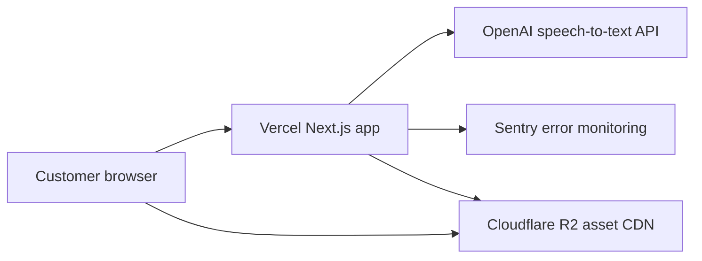

# Production Architecture

## Principles

- Keep the POC app behavior unchanged until a specific production-hardening implementation pass is approved.
- Move only deployment concerns into this folder.
- Never depend on `localhost`, local Whisper, local files, or developer machine state for customer access.
- Keep the first screen fast by loading preview assets first and high-resolution geology assets only on demand.

## Runtime Architecture



## Request Flow

1. Customer opens the Vercel-hosted app.
2. App shell loads quickly with command bar, HUD, and first scene.
3. Large terrain/model/texture files are fetched directly from Cloudflare R2.
4. Voice commands use browser speech recognition directly; no local transcription server is required.
5. The server route sends audio to OpenAI using a server-only API key.
6. Transcript is mapped into the existing deterministic command parser.
7. Typed commands bypass transcription and remain the reliability fallback.

## Asset Strategy

Large files should be served from R2 with a custom asset domain:

- `height.bin`
- `texture_rgb_8192.png`
- `terrain_texture_8k.jpg`
- `drillholes_utm.json`
- `assay_data.geojson`
- `lithology_data.geojson`
- `resource_model.bin`
- `earth.glb`
- `geologicalModel.glb`

Use a versioned prefix:

```text
https://assets.example.com/tanga/v2026-06-06/height_preview_1024.bin
https://assets.example.com/tanga/v2026-06-06/resource_model.bin
```

## Voice Strategy

Production voice should not use the current local Whisper endpoint directly. The production route should support:

- `VOICE_PROVIDER=openai`
- `OPENAI_API_KEY`
- `OPENAI_TRANSCRIBE_MODEL=gpt-4o-mini-transcribe`
- a strict timeout
- a clear fallback message when voice is unavailable

Typed commands must always remain available.

## Budget Constraint

The USD 100/month plan does not include a paid Cesium ion commercial plan. Production should prefer the app's own R2-hosted terrain, texture, and model assets for customer demos.


